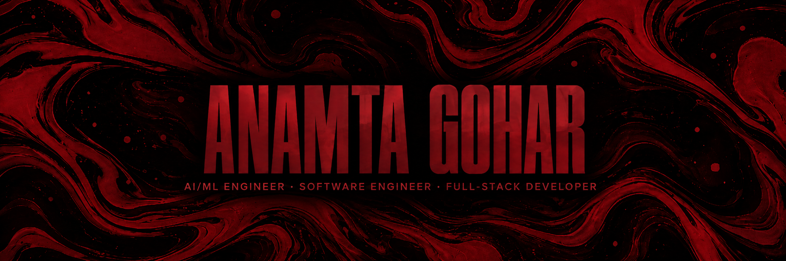

<!--
Anamta Gohar | anamta-JINX
AI/ML Engineer · LLM/RAG Systems · Software Engineer · Full-Stack Developer
Artificial Intelligence · Machine Learning · Deep Learning · Generative AI · Computer Vision · MERN
Lahore, Pakistan
Portfolio: https://anamtasportfolio.netlify.app/
-->

  

  

  
  &nbsp;&nbsp;
  
  &nbsp;&nbsp;
  
  &nbsp;&nbsp;
  
  &nbsp;&nbsp;
  

## About Me

Hey, I'm Anamta.

I'm a curious, slightly overthinking, always-learning kind of person who can go from “I should probably rest” to “let me just try one more feature” at 3 AM.

I'm a Full-Stack, Frontend, and AI/ML Developer who enjoys building things, breaking them (accidentally), fixing them (eventually), and then convincing myself it was all part of the plan. I like turning ideas into real products, especially in AI, machine learning, LLMs, automation, and anything that feels even slightly futuristic.

I’m constantly exploring new technologies—not because I have to, but because my brain refuses to leave things alone once I find them interesting. I enjoy understanding how things work under the hood, even if it means falling into a 6-hour rabbit hole for one concept.

Outside of tech, I’m a chess player and basketball team captain—mostly as a way to test my patience and pretend I have control over chaos. I enjoy anything that involves creativity, strategy, or the occasional existential crisis mid-game.

▶ I’m currently working on improving my skills in AI/ML, full-stack systems, and frontend skills, more practical applications  

▶ I’m looking to collaborate on interesting ideas, AI tools, and anything that solves real-world problems  

▶ I’m looking for help with scaling ideas into production-ready systems and learning better architecture patterns  

▶ I’m currently learning advanced AI/ML concepts, LLM / RAG systems, flutter and better software design practices  

▶ Ask me about Full-Stack Development, AI/ML, LLMs, or why I still debug things at 3 AM  

▶ Fun fact: I can solve a Rubik’s cube in 20 secs, but I still sometimes can’t figure out why my code worked before I touched it

## Tech Stack

<b>AI / ML DOMAINS</b>

  
  
  
  
  
  
  
  
  
  
  
  
  
  
  
  

<b>AI / ML &amp; DATA</b>

  
  &nbsp;&nbsp;
  
  &nbsp;&nbsp;
  
  &nbsp;&nbsp;
  
  &nbsp;&nbsp;
  
  &nbsp;&nbsp;
  
  &nbsp;&nbsp;
  
  &nbsp;&nbsp;
  
  &nbsp;&nbsp;
  

<b>MERN STACK</b>

  
  &nbsp;&nbsp;
  
  &nbsp;&nbsp;
  
  &nbsp;&nbsp;
  

<b>SOFTWARE DEVELOPMENT</b>

  
  &nbsp;&nbsp;
  
  &nbsp;&nbsp;
  
  &nbsp;&nbsp;
  
  &nbsp;&nbsp;
  
  &nbsp;&nbsp;
  
  &nbsp;&nbsp;
  
  &nbsp;&nbsp;
  
  &nbsp;&nbsp;
  
  &nbsp;&nbsp;
  
  &nbsp;&nbsp;
  
  &nbsp;&nbsp;
  
  &nbsp;&nbsp;
  
  &nbsp;&nbsp;
  
  &nbsp;&nbsp;
  
  &nbsp;&nbsp;
  
  &nbsp;&nbsp;
  

<b>DATABASES / RETRIEVAL</b>

  
  &nbsp;&nbsp;
  
  &nbsp;&nbsp;
  
  &nbsp;&nbsp;
  

  <code>Vector Databases</code> · <code>Chroma</code> · <code>Pinecone</code> · <code>Weaviate</code> · <code>pgvector</code>

<b>CLOUD &amp; TOOLS</b>

  
  &nbsp;&nbsp;
  
  &nbsp;&nbsp;
  
  &nbsp;&nbsp;
  
  &nbsp;&nbsp;
  
  &nbsp;&nbsp;
  
  &nbsp;&nbsp;
  
  &nbsp;&nbsp;
  
  &nbsp;&nbsp;
  
  &nbsp;&nbsp;
  
  &nbsp;&nbsp;
  
  &nbsp;&nbsp;
  
  &nbsp;&nbsp;
  

## GitHub Activity

  
  

  

  <picture>
    <source media="(prefers-color-scheme: dark)" srcset="assets/github-snake-dark.svg" />
    <source media="(prefers-color-scheme: light)" srcset="assets/github-snake.svg" />
    
  </picture>

  

